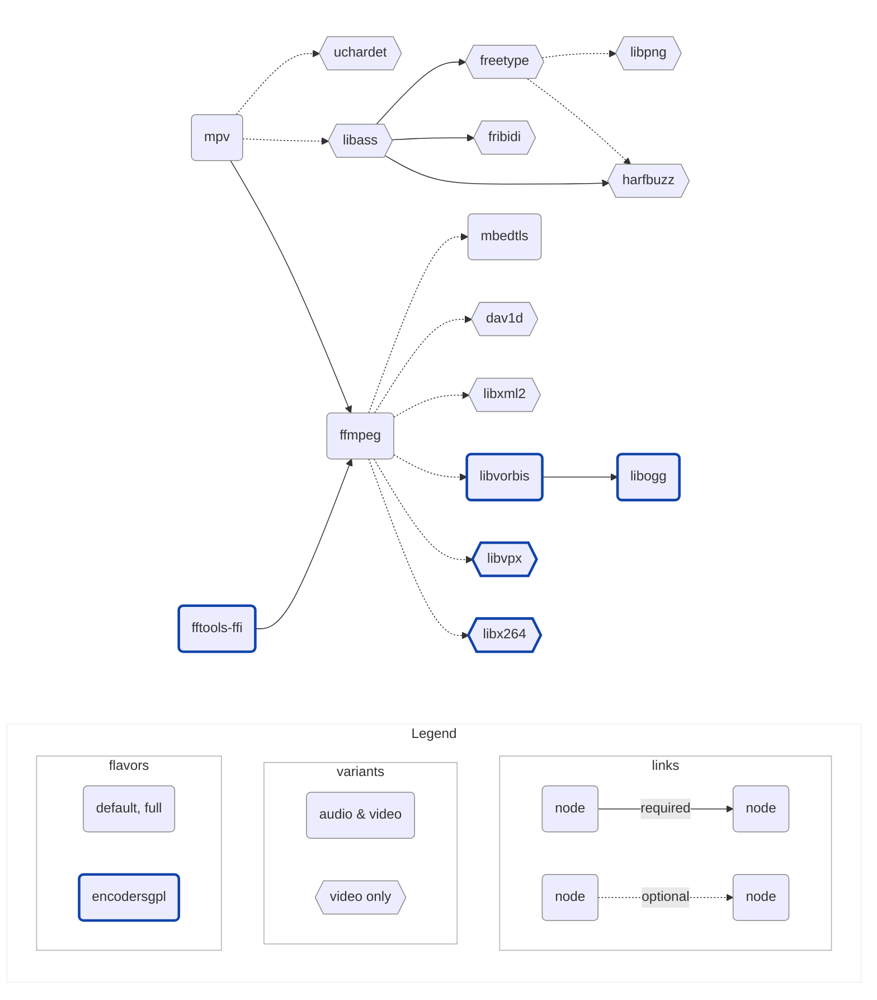

# libmpv build

Provides builds of [libmpv](https://github.com/mpv-player/mpv) for macOS & iOS,
used by [media_kit](https://github.com/alexmercerind/media_kit), compatible
with commercial use for playback, and GPL use for encoding.

Heavily inspired by [Homebrew](https://github.com/Homebrew/brew) and
[IINA](https://github.com/iina/iina).

## Setup

- Nix: [nixos.org/download/#nix-install-macos](https://nixos.org/download/#nix-install-macos)
- Xcode: [./nix/overlays/xcode.md#how-to-store-xcode-and-prevent-to-be-garbage-collected](./nix/overlays/xcode.md#how-to-store-xcode-and-prevent-to-be-garbage-collected)

## Build

```shell
$ echo \"v0.0.1\" > nix/utils/default/version.nix
$ nix build -v
$ tree result
```

<details>
<summary>result</summary>

```shell
├── libmpv-libs_v0.0.1_ios-arm64-audio-default.tar.gz
├── libmpv-libs_v0.0.1_ios-arm64-audio-encodersgpl.tar.gz
├── libmpv-libs_v0.0.1_ios-arm64-audio-full.tar.gz
├── libmpv-libs_v0.0.1_ios-arm64-video-default.tar.gz
├── libmpv-libs_v0.0.1_ios-arm64-video-encodersgpl.tar.gz
├── libmpv-libs_v0.0.1_ios-arm64-video-full.tar.gz
├── libmpv-libs_v0.0.1_iossimulator-amd64-audio-default.tar.gz
├── libmpv-libs_v0.0.1_iossimulator-amd64-audio-encodersgpl.tar.gz
├── libmpv-libs_v0.0.1_iossimulator-amd64-audio-full.tar.gz
├── libmpv-libs_v0.0.1_iossimulator-amd64-video-default.tar.gz
├── libmpv-libs_v0.0.1_iossimulator-amd64-video-encodersgpl.tar.gz
├── libmpv-libs_v0.0.1_iossimulator-amd64-video-full.tar.gz
├── libmpv-libs_v0.0.1_iossimulator-arm64-audio-default.tar.gz
├── libmpv-libs_v0.0.1_iossimulator-arm64-audio-encodersgpl.tar.gz
├── libmpv-libs_v0.0.1_iossimulator-arm64-audio-full.tar.gz
├── libmpv-libs_v0.0.1_iossimulator-arm64-video-default.tar.gz
├── libmpv-libs_v0.0.1_iossimulator-arm64-video-encodersgpl.tar.gz
├── libmpv-libs_v0.0.1_iossimulator-arm64-video-full.tar.gz
├── libmpv-libs_v0.0.1_iossimulator-universal-audio-default.tar.gz
├── libmpv-libs_v0.0.1_iossimulator-universal-audio-encodersgpl.tar.gz
├── libmpv-libs_v0.0.1_iossimulator-universal-audio-full.tar.gz
├── libmpv-libs_v0.0.1_iossimulator-universal-video-default.tar.gz
├── libmpv-libs_v0.0.1_iossimulator-universal-video-encodersgpl.tar.gz
├── libmpv-libs_v0.0.1_iossimulator-universal-video-full.tar.gz
├── libmpv-libs_v0.0.1_macos-amd64-audio-default.tar.gz
├── libmpv-libs_v0.0.1_macos-amd64-audio-encodersgpl.tar.gz
├── libmpv-libs_v0.0.1_macos-amd64-audio-full.tar.gz
├── libmpv-libs_v0.0.1_macos-amd64-video-default.tar.gz
├── libmpv-libs_v0.0.1_macos-amd64-video-encodersgpl.tar.gz
├── libmpv-libs_v0.0.1_macos-amd64-video-full.tar.gz
├── libmpv-libs_v0.0.1_macos-arm64-audio-default.tar.gz
├── libmpv-libs_v0.0.1_macos-arm64-audio-encodersgpl.tar.gz
├── libmpv-libs_v0.0.1_macos-arm64-audio-full.tar.gz
├── libmpv-libs_v0.0.1_macos-arm64-video-default.tar.gz
├── libmpv-libs_v0.0.1_macos-arm64-video-encodersgpl.tar.gz
├── libmpv-libs_v0.0.1_macos-arm64-video-full.tar.gz
├── libmpv-libs_v0.0.1_macos-universal-audio-default.tar.gz
├── libmpv-libs_v0.0.1_macos-universal-audio-encodersgpl.tar.gz
├── libmpv-libs_v0.0.1_macos-universal-audio-full.tar.gz
├── libmpv-libs_v0.0.1_macos-universal-video-default.tar.gz
├── libmpv-libs_v0.0.1_macos-universal-video-encodersgpl.tar.gz
├── libmpv-libs_v0.0.1_macos-universal-video-full.tar.gz
├── libmpv-xcframeworks_v0.0.1_ios-universal-audio-default.tar.gz
├── libmpv-xcframeworks_v0.0.1_ios-universal-audio-encodersgpl.tar.gz
├── libmpv-xcframeworks_v0.0.1_ios-universal-audio-full.tar.gz
├── libmpv-xcframeworks_v0.0.1_ios-universal-video-default.tar.gz
├── libmpv-xcframeworks_v0.0.1_ios-universal-video-encodersgpl.tar.gz
├── libmpv-xcframeworks_v0.0.1_ios-universal-video-full.tar.gz
├── libmpv-xcframeworks_v0.0.1_macos-universal-audio-default.tar.gz
├── libmpv-xcframeworks_v0.0.1_macos-universal-audio-encodersgpl.tar.gz
├── libmpv-xcframeworks_v0.0.1_macos-universal-audio-full.tar.gz
├── libmpv-xcframeworks_v0.0.1_macos-universal-video-default.tar.gz
├── libmpv-xcframeworks_v0.0.1_macos-universal-video-encodersgpl.tar.gz
└── libmpv-xcframeworks_v0.0.1_macos-universal-video-full.tar.gz
```
</details>

## Build a specific target

```shell
$ nix flake show
$ nix build -v .#mk-out-archive-libs-macos-universal-video-default
$ open result
```

## Naming convention

```
libmpv-<format>_<version>_<os>-<arch>-<variant>-<flavor>.tar.gz
```

| Component   | Notes                           | Value                      |
| ----------- | ------------------------------- | -------------------------- |
| **format**  | Output format of built files    | libs, xcframeworks         |
| **version** | Semantic version                | v0.0.1, …                  |
| **os**      | Operating system                | ios, iossimulator, macos   |
| **arch**    | Architecture                    | arm64, amd64, universal    |
| **variant** | Usage context                   | audio, video               |
| **flavor**  | Available decoders and encoders | default, full, encodersgpl |

Inclusion:

- Variants: $audio \subset video$
- Flavors: $audio \subset full \subset encodersgpl$

## Minimum versions

<table>
  <thead>
    <tr>
      <th>Platform</th>
      <th>Arch</th>
      <th>Min Version</th>
      <th>Notes</th>
    </tr>
  </thead>
  <tbody>
    <tr>
      <td rowspan="2"><strong>macOS</strong></td>
      <td>amd64</td>
      <td rowspan="2"><code>10.9</code></td>
      <td rowspan="2">Required by <code>uchardet</code></td>
    </tr>
    <tr>
      <td>arm64</td>
    </tr>
    <tr>
      <td><strong>iOS</strong></td>
      <td>arm64</td>
      <td><code>9.0</code></td>
      <td>Required by <code>ffmpeg</code></td>
    </tr>
    <tr>
      <td rowspan="2"><strong>iOS Simulator</strong></td>
      <td>amd64</td>
      <td><code>9.0</code></td>
      <td>Required by <code>ffmpeg</code></td>
    </tr>
    <tr>
      <td>arm64</td>
      <td><code>12.0</code></td>
      <td>Required by <code>xcodebuild -create-xcframework</code></td>
    </tr>
  </tbody>
</table>

## Dependencies



- [**mpv**](https://github.com/mpv-player/mpv): A free (as in freedom) media
  player for the command line. It supports a wide variety of media file formats,
  audio and video codecs, and subtitle types

- [**ffmpeg**](https://ffmpeg.org): A cross-platform solution for converting,
  streaming, and recording audio and video, with support for a wide range of
  codecs and formats

- [**fftools-ffi**](https://github.com/moffatman/fftools-ffi): FFmpeg's
  command-line interface exposed as a shared library for FFI usage

- [**libass**](https://github.com/libass/libass): A library for rendering
  subtitles in videos, with support for advanced text formatting and positioning
  features (made optional with a patch)

- [**fribidi**](https://github.com/fribidi/fribidi): A library for handling
  bidirectional text (such as Arabic or Hebrew) in Unicode strings, with support
  for complex shaping and layout

- [**freetype**](https://sourceforge.net/projects/freetype/): A library for
  rendering high-quality text in graphics applications, with support for a wide
  range of font formats and glyph rendering techniques

- [**harfbuzz**](https://github.com/harfbuzz/harfbuzz): A library for shaping
  and laying out text in multiple languages and scripts, with support for
  advanced typography features such as ligatures and kerning

- [**libpng**](https://github.com/pnggroup/libpng): A library for reading and
  writing PNG (Portable Network Graphics) images, providing efficient image
  compression and lossless data handling

- [**dav1d**](https://code.videolan.org/videolan/dav1d): A library for
  cross-platform AV1 decoding

- [**libogg**](https://github.com/xiph/ogg): Reference implementation of the Ogg
  media container

- [**libvorbis**](https://github.com/xiph/vorbis): Reference implementation of
  the Ogg Vorbis audio format

- [**libvpx**](https://gitlab.freedesktop.org/gstreamer/meson-ports/libvpx):
  Reference implementation of the VP8 and VP9 video formats

- [**libx264**](https://www.videolan.org/developers/x264.html): Free software
  library for encoding video streams into the H.264/MPEG-4 AVC compression
  format

- [**mbedtls**](https://www.libressl.org/): An open source, portable, easy to
  use, readable and flexible TLS library

- [**libxml2**](http://xmlsoft.org/): A library for processing XML data, used by
  ffmpeg to support the Dash protocol

- [**uchardet**](https://www.freedesktop.org/wiki/Software/uchardet/): A C++
  port of the Universal Character Encoding Detector (used by Mozilla Firefox
  and Thunderbird) for detecting the encoding of input text

## Commercial use

### Default, Full flavors

| Dependency | Licence                                                | Commercial use |
| ---------- | ------------------------------------------------------ | :------------: |
| mpv        | LGPL-2.1 (`-Dgpl=false`)                               |       ✅       |
| ffmpeg     | LGPL-2.1 (`--enable-gpl` & `--enable-nonfree` omitted) |       ✅       |
| libass     | ISC                                                    |       ✅       |
| freetype   | FreeType                                               |       ✅       |
| harfbuzz   | MIT                                                    |       ✅       |
| fribidi    | LGPL-2.1                                               |       ✅       |
| libpng     | zlib/libpng                                            |       ✅       |
| mbedtls    | Apache 2.0                                             |       ✅       |
| uchardet   | MPL-1.1, GPL-2, LGPL-2.1                               |       ✅       |
| libxml2    | MIT                                                    |       ✅       |
| dav1d      | BSD-2-clause                                           |       ✅       |

### Encoders-GPL flavor

| Dependency  | Licence                              | Commercial use |
| ----------- | ------------------------------------ | :------------: |
| mpv         | LGPL-2.1 (`-Dgpl=false`)             |       ✅       |
| ffmpeg      | GPL-2.1 (`--enable-nonfree` omitted) |       ❌       |
| libass      | ISC                                  |       ✅       |
| freetype    | FreeType                             |       ✅       |
| harfbuzz    | MIT                                  |       ✅       |
| fribidi     | LGPL-2.1                             |       ✅       |
| libpng     | zlib/libpng                           |       ✅       |
| mbedtls     | Apache 2.0                           |       ✅       |
| uchardet    | MPL-1.1, GPL-2, LGPL-2.1             |       ✅       |
| libxml2     | MIT                                  |       ✅       |
| dav1d       | BSD-2-clause                         |       ✅       |
| fftools-ffi | LGPL-2.1                             |       ✅       |
| libx264     | GPL-2.0+                             |       ❌       |
| libvpx      | BSD-3-clause                         |       ✅       |
| libvorbis   | BSD-3-clause                         |       ✅       |
| libogg      | BSD-3-clause                         |       ✅       |

## Notes

- Some dependencies, which are not needed at the moment, may be added in the
  future:

  - [**libbluray**](https://code.videolan.org/videolan/libbluray): A library for
    reading and parsing Blu-ray discs, with support for advanced features such
    as BD-J menus and seamless branching

  - [**libarchive**](https://github.com/libarchive/libarchive): A library for
    reading various archive formats, including tar and zip, with support for
    compression and metadata, and a flexible API for reading and extracting
    archive contents

- We use `meson` as much as possible in order to simplify cross-compilation, at
  the cost of some heaviness regarding legacy packages

## How the libass optional patch was created

As the dependency of mpv on libass is deeply embedded in the code, the simplest
solution was to:

1. Remove the dynamic linking in `meson.build`.
2. Include the `ass/ass.h` and `ass/ass_types.h` headers directly in the code
3. Remove the call to `ass_library_version` in `player/command.c`
4. Remove the calls to `ass_library_init`, called by `mp_ass_init`, in
   `sub/osd_libass.c` and `sub/sd_ass.c`

## Resources

- https://github.com/stps/mpv-ios-scripts
- https://github.com/iina/homebrew-mpv-iina
- https://github.com/mpv-android/mpv-android
- https://github.com/jnozsc/mpv-nightly-build
- https://github.com/smplayer-dev/mpv
- https://github.com/smplayer-dev/smplayer
- https://github.com/ldwardx/mpv-build-mac-iOS
- https://github.com/birros/godot_tl/tree/ca2fc4151bd8141241151dd6e29768608600473a/toolchains
- https://github.com/Vargol/ffmpeg-apple-arm64-build
- https://github.com/arthenica/ffmpeg-kit
