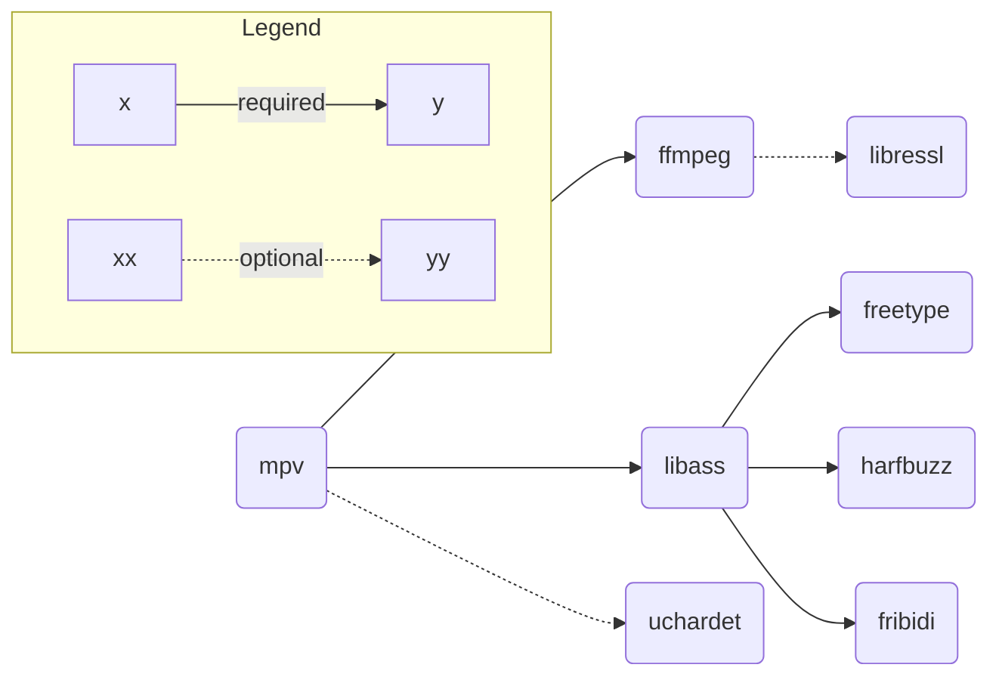

## Commercial use

The purpose of this build is to be compatible with commercial use

| Nom      | Licence                                                | Commercial use |
| -------- | ------------------------------------------------------ | :------------: |
| mpv      | LGPL-2.1 (`-Dgpl=false`)                               |       ✅       |
| ffmpeg   | LGPL-2.1 (`--enable-gpl` & `--enable-nonfree` omitted) |       ✅       |
| libass   | ISC                                                    |       ✅       |
| freetype | FreeType                                               |       ✅       |
| harfbuzz | MIT                                                    |       ✅       |
| fribidi  | LGPL-2.1                                               |       ✅       |
| libressl | Apache-1.0, BSD-4-Clause, ISC, public domain           |       ✅       |
| uchardet | MPL-1.1, GPL-2, LGPL-2.1                               |       ✅       |

## Dependency graph

## Todo

- [ ] Improving dependencies flags
- [ ] Compare conf with what brew does

## Resources

- https://github.com/stps/mpv-ios-scripts
- https://github.com/iina/homebrew-mpv-iina
- https://github.com/mpv-android/mpv-android
- https://github.com/jnozsc/mpv-nightly-build
- https://github.com/smplayer-dev/mpv
- https://github.com/smplayer-dev/smplayer
- https://github.com/ldwardx/mpv-build-mac-iOS
- https://github.com/birros/godot_tl/tree/ca2fc4151bd8141241151dd6e29768608600473a/toolchains
- https://github.com/Vargol/ffmpeg-apple-arm64-build
