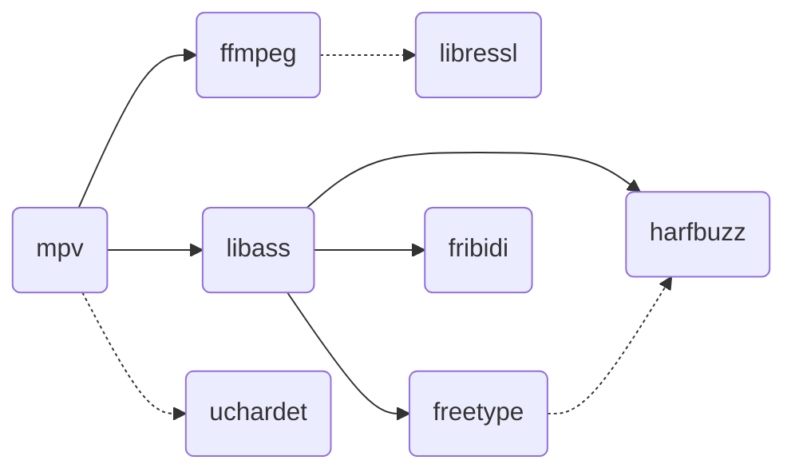

# libmpv Build

Provides builds of [libmpv](https://github.com/mpv-player/mpv) for macOS, usable
by [media_kit](https://github.com/alexmercerind/media_kit), compatible with
commercial use.

Heavily inspired by [Homebrew](https://github.com/Homebrew/brew) and
[IINA](https://github.com/iina/iina).

## Usage

```shell
$ brew install cmake golang go-task meson ninja
$ VERSION=0.0.1 task
$ ls build/darwin/universal/libs
libass.9.dylib
libavcodec.59.dylib
libavfilter.8.dylib
...
$ ls build/darwin/universal/packages
libmpv-0.0.1-darwin-universal.tar.gz
```

## Dependencies



- [**ffmpeg**](https://ffmpeg.org): A cross-platform solution for converting,
  streaming, and recording audio and video, with support for a wide range of
  codecs and formats

- [**libass**](https://github.com/libass/libass): A library for rendering
  subtitles in videos, with support for advanced text formatting and positioning
  features

- [**fribidi**](https://github.com/fribidi/fribidi): A library for handling
  bidirectional text (such as Arabic or Hebrew) in Unicode strings, with support
  for complex shaping and layout

- [**freetype**](https://sourceforge.net/projects/freetype/): A library for
  rendering high-quality text in graphics applications, with support for a wide
  range of font formats and glyph rendering techniques

- [**harfbuzz**](https://github.com/harfbuzz/harfbuzz): A library for shaping
  and laying out text in multiple languages and scripts, with support for
  advanced typography features such as ligatures and kerning

- **[libressl](https://www.libressl.org/) (optional)**: A fork of OpenSSL that
  aims to provide a more secure and auditable implementation of the SSL/TLS
  protocols

- **[uchardet](https://www.freedesktop.org/wiki/Software/uchardet/)
  (optional)**: A C++ port of the Universal Character Encoding Detector (used by Mozilla Firefox and Thunderbird) for detecting the encoding of input text

## Commercial Use

| Dependency | Licence                                                | Commercial use |
| ---------- | ------------------------------------------------------ | :------------: |
| mpv        | LGPL-2.1 (`-Dgpl=false`)                               |       ✅       |
| ffmpeg     | LGPL-2.1 (`--enable-gpl` & `--enable-nonfree` omitted) |       ✅       |
| libass     | ISC                                                    |       ✅       |
| freetype   | FreeType                                               |       ✅       |
| harfbuzz   | MIT                                                    |       ✅       |
| fribidi    | LGPL-2.1                                               |       ✅       |
| libressl   | Apache-1.0, BSD-4-Clause, ISC, public domain           |       ✅       |
| uchardet   | MPL-1.1, GPL-2, LGPL-2.1                               |       ✅       |

## Notes

Some dependencies, which are not needed at the moment, may be added in the
future:

- [**libbluray**](https://code.videolan.org/videolan/libbluray): A library for
  reading and parsing Blu-ray discs, with support for advanced features such as
  BD-J menus and seamless branching

- [**libarchive**](https://github.com/libarchive/libarchive): A library for
  reading various archive formats, including tar and zip, with support for
  compression and metadata, and a flexible API for reading and extracting
  archive contents

We use `meson` as much as possible in order to simplify cross-compilation, at
the cost of some heaviness regarding legacy packages.

## Todo

- [ ] Deploy to GitHub Actions

## Project Layout

```
.
├── ...
├── cmd                       # golang scripts
├── pkg                       # golang packages
├── downloads                 # dependencies archives are downloaded here
├── downloads.lock            # lock file of dependencies archives
├── Taskfile.yaml             # main build script
├── scripts                   # build scripts
├── cross-files               # cross build files used by meson
├── build
│   ├── tools                 # "sanboxed" tools & pkg-config are stored here
│   └── darwin
│       ├── universal         # amd64 & arm64 builds are merge here with lipo
│       ├── amd64
│       └── arm64
│           ├── sources       # archives are extracted here
│           ├── chroot        # cross built files
│           │   ├── include
│           │   └── lib
│           ├── libs          # cleaned libs from `chroot/lib`.
│           └── packages      # zip & tar.gz of `libs`
└── ...
```

## Resources

- https://github.com/stps/mpv-ios-scripts
- https://github.com/iina/homebrew-mpv-iina
- https://github.com/mpv-android/mpv-android
- https://github.com/jnozsc/mpv-nightly-build
- https://github.com/smplayer-dev/mpv
- https://github.com/smplayer-dev/smplayer
- https://github.com/ldwardx/mpv-build-mac-iOS
- https://github.com/birros/godot_tl/tree/ca2fc4151bd8141241151dd6e29768608600473a/toolchains
- https://github.com/Vargol/ffmpeg-apple-arm64-build
